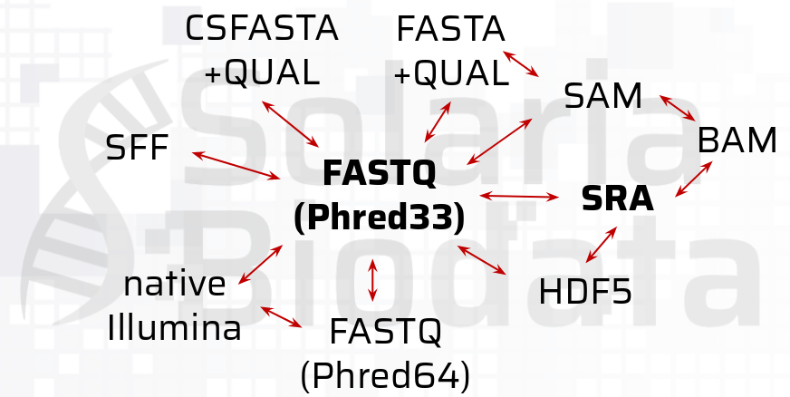

# Nextera DNA Workshop - Sesión de Control de Calidad

## Sesión Práctica

### Descripción
En esta sesión aprenderemos lo necesario para evaluar la calidad de genotecas preparadas con la plataforma de Illumina, teniendo a consideración los formatos de archivos y cómo poder generar nuestras propias gráficas de calidad.

### Requisitos

Para poder realizar este ejercicio, necesitaremos:

1. Datos de secuencias:
    - Puedes usar tus propias secuencias, en formato FASTQ o FASTQ.GZ
2. Acceso a los siguientes recursos de internet:
    - Página de [NCBI](https://www.ncbi.nlm.nih.gov/)
    - Página de [SRA](https://www.ncbi.nlm.nih.gov/sra)
3. Sofware Recomendable para esta sesión:
    - Terminal (Mac o Linux)
    - Putty (Windows)
    - WinSCP (Windows)

## Ejercicio 01:
### Descripción
A continuación, observaremos la estructura de un archivo de lecturas en formato FASTQ, el cual es utilizado de manera estándar en múltiples plataformas de secuenciación masiva.

### Instrucciones (Parte 01)
1. Para descomprimir los archivos en extensión FASTQ.GZ, usamos:
    ~~~
    gzip -d archivo.fastq.gz
    ~~~
    Este paso no es necesario en muchos procesamientos, sin embargo ayuda a familiarizarse con el contenido del archivo.
### Instrucciones (Parte 02)
1. Abre las primeras 16 líneas de tu archivo FASTQ favorito:
    ~~~
    head -16 archivo.fastq
    ~~~
2. Determina la lectura con el nucleótido con la calidad más pobre
3. Encuentra los patrones de nombre en los descriptores
4. Encuentra los nombres de los 10 primeros descriptores utilizando:
    ~~~
    grep "^@" archivo.fastq | head -10
    ~~~
5. Encuentra los nombres de los 10 primeros descriptores de calidad utilizando:
    ~~~
    grep "^+" archivo.fastq | head -10
    ~~~
6. Para saber el número de secuencias en el archivo de secuenciación:
    ~~~
    grep -c "^@" archivo.fastq
    ~~~
## Ejercicio 02: Conversión de Formatostre
### Descripción
Entre distintas plataformas de secuenciación, no necesariamente utiliza el archivo FASTQ como formato predeterminado. Anteriormente se utilizaban distintos formatos y en la actualidad, también es posible encontrar múltiples formatos para almacenar secuencias. A continuación, un gráfico de distintas relaciones entre formatos:

### Instrucciones
1. Conversión de Formato HDF5 a FASTQ:
    ~~~
    python bash5tools.py --inFile input.bas.h5 --outFilePref reads --outType fastq \
    --readType subreads --minLength 500 --minReadScore 0.8
    ~~~
2. Conversión de Formato SFF a FASTQ:
    ~~~
    cat input.sff | sff2fastq > reads.fastq
    ~~~
3. Conversión de Formato FASTAQUAL a FASTQ
    ~~~
    fastaQual2fastq.pl input.fasta input.qual
    ~~~
4. Conversión de Formatos BAM/SAM a FASTQ
    ~~~
    samtools fastq input.*am > reads.fastq
    ~~~

## Ejercicio 03: Ejecución de FASTQC
### Descripción
A pesar de que los equipos actuales de secuenciación prometen o despliegan secuencias que parecen de alta calidad, existen algunos factores que afectan la calidad del llamado de bases.

### Instrucciones
1. Si ejecutan fastqc sin argumentos se abre la versión gráfica
    ~~~
    fastqc reads.fastq
    ~~~
